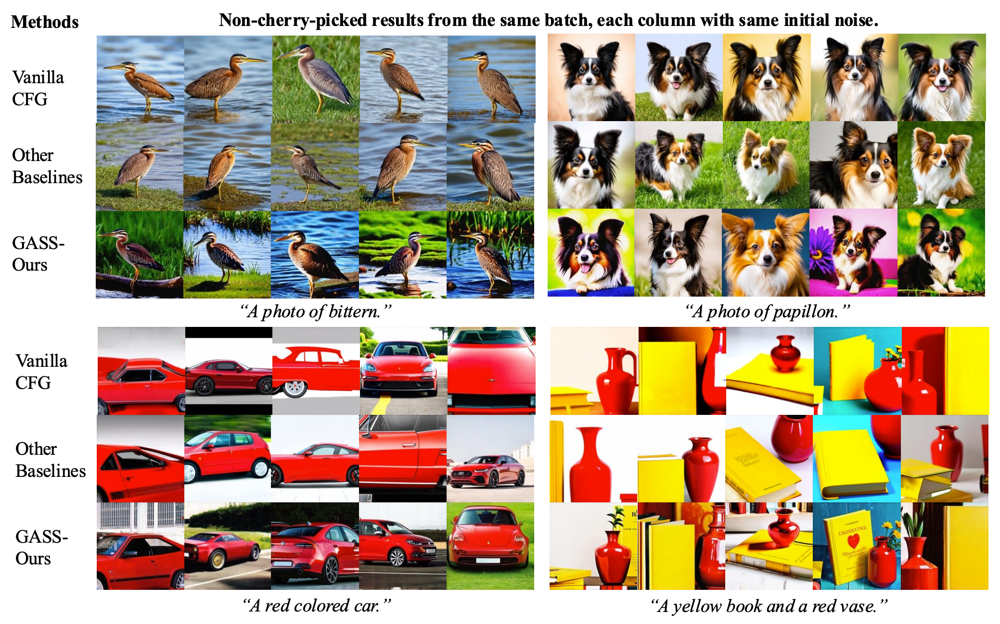
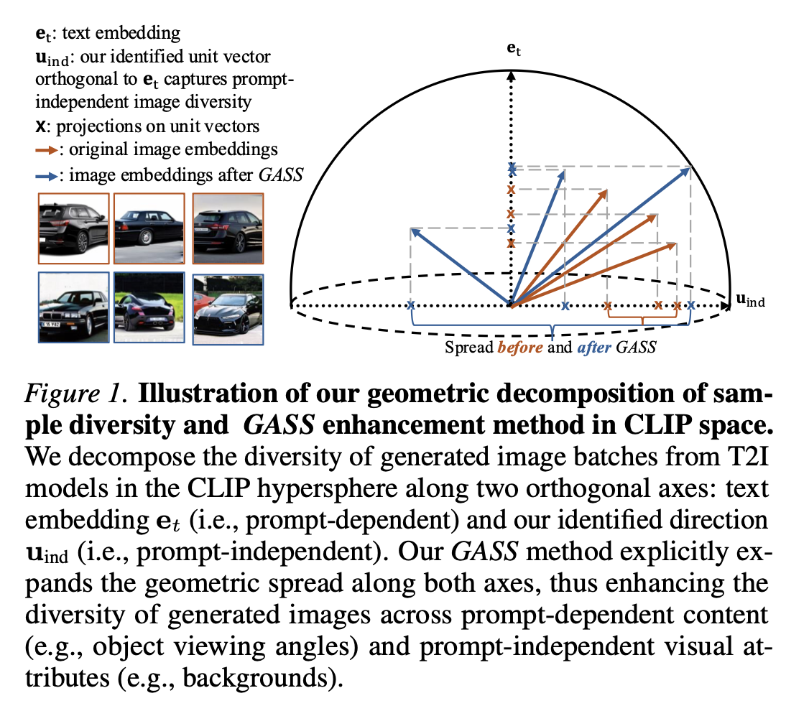

# Geometry-Aware Spherical Sampling (GASS) for Diverse Text-to-Image Generation

Ye Zhu (*LIX, CNRS, École Polytechnique & CS, Princeton*), Kaleb Newman (*CS, Princeton*), Johannes F. Lutzeyer (*LIX, CNRS, École Polytechnique*), Adriana Romero-Soriano (*FAIR at Meta - Montreal & McGill University & Mila & Canada CIFAR AI chair*), Michal Drozdzal (*FAIR at Meta - Montreal*), Olga Russakovsky (*CS, Princeton*)

This is the official Pytorch implementation of the ICML 2026 paper **[GASS: Geometry-Aware Spherical Sampling for Disentangled Diversity Enhancement in Text-to-Image Generation](https://arxiv.org/abs/2602.17200)**.

Below we show non-cherry-picked qualitative results of our proposed **GASS** sampling method compared to the vanilla CFG (classifier-free guidance) sampling baseline and other more recent diversity enhancement methods.


<p align="center">
	


## 1. Motivation and problem


We consider the task of amplifying the sample diversity for text-to-image generative models given a fixed prompt. Instead of framing this as an entropy enhancement problem like most prior work does, we formulate this as a geometrical challenge, with the goal of increasing the geometrical spread covered by a batch of generated images within a hypersphere.


<p align="center">
	


## 2. Environment setup

We used the 


## 3. Dataset preparation

The prompt files of ImageNet and Drawbench can be found in the folder ```./datasets```. For ImageNet, we used a template ```A photo of [class name]``` for each prompt. 


## 4. Base CFG and GASS Sampling 

We 


## 5. Citation

If you find our work interesting and useful, please consider citing it.


### Acknowledgements

This project is primarily supported through the research grant from Meta Inc..
